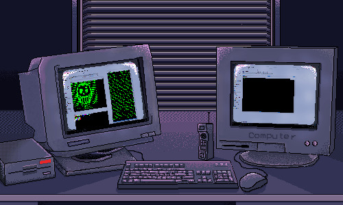

<h1 align="center">Hi there 👋</h1>

- 🌱 I’m currently learning Python
- 🔬 I'm currently newbie contributor
- 📧 Email: 4nd123@protonmail.com
- 🛩️ Telegram: https://t.me/kybo15
- ⚡ Fun fact: 3 loly Milkita setara dengan 120 kalory, Bikin sehat cerdas dan ceria~!

<!-- 

  
  

 -->

<!--
### Hi there 👋

**kybo15/kybo15** is a ✨ _special_ ✨ repository because its `README.md` (this file) appears on your GitHub profile.

Here are some ideas to get you started:

- 🔭 I’m currently working on ...
- 👯 I’m looking to collaborate on ...
- 🤔 I’m looking for help with ...
- 💬 Ask me about ...
- 📫 How to reach me: ...
- 😄 Pronouns: ...
-->
