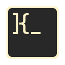

# Hi there  I'm Andre

My purpose to *learn* and *observe* open source code to be useful knowledge for myself or others. and I'm also currently contributing to several organizations such as [Dracula Theme](<https://github.com/dracula/>) and [Magisk-Modules-Repo](<https://github.com/Magisk-Modules-Repo/>) (*vacuum*).

## 🔎 Find me?

🚀 [Website](https://kybo15.github.io) 
🐦 [Twitter](https://twitter.com/R007MMXV) 
💼 [LinkedIn](https://www.linkedin.com/in/andre-attamimi-453109230) 
🎬 [YouTube](https://www.youtube.com/channel/UCKeqgzkfyowT1N-zIpGw-NA) 

<!--  -->
